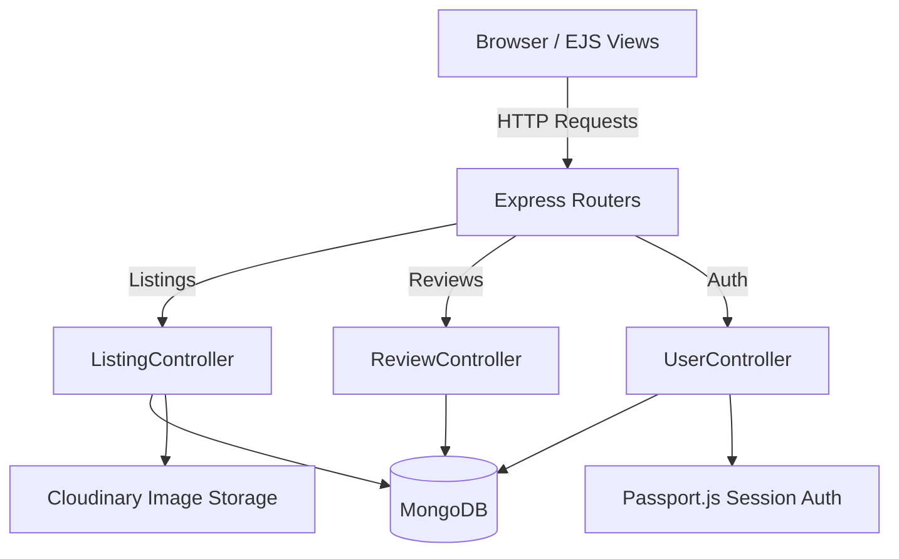
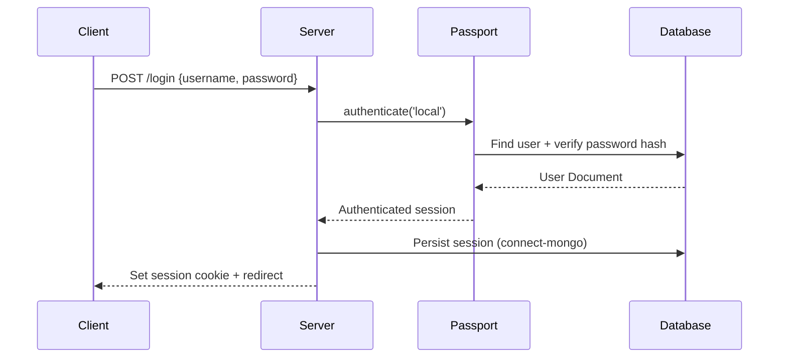
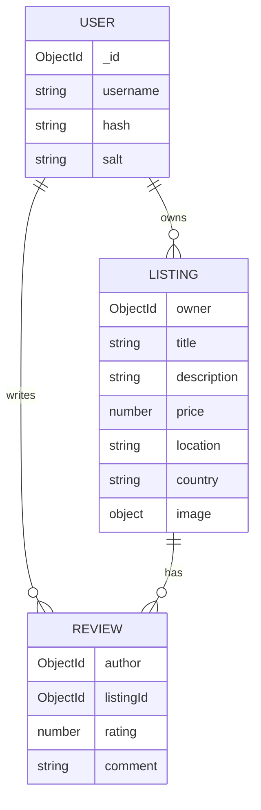

<div align="center">

# Tourora

A premium full-stack travel marketplace enabling users to list, discover, unique accommodations worldwide.


<br />

[Live Demo](https://tourora-7dot.onrender.com) · [Documentation](#overview) · [Report Bug](#) · [Request Feature](#)

</div>

**Current Version:** 1.0.0
**Project Status:** Development / Production-Ready

---

## Overview

**What the project does:**
Tourora is a full-stack travel marketplace that lets users list, discover, and book unique accommodations worldwide, built on a robust MVC architecture.

**Why it was built & Problem it solves:**
Finding and booking reliable local stays is often fragmented across unreliable listings and poor search experiences. Tourora solves this with real-time filtering, category-based discovery, and secure, authenticated listing/review management.

**Target users:**
Travelers looking for accommodations, and hosts looking to list properties, on a lightweight self-hostable marketplace platform.

**Key capabilities:**
- Real-time backend search filtering by Title, Location, or Country.
- Category-based discovery (Trending, Rooms, Mountains, etc.) with responsive listing cards.
- Secure authenticated listings, reviews, and cloud-based image hosting.

---

## Features

### Search & Discovery
- **Global Search:** Find accommodations by Title, Location, or Country with real-time backend filtering.
- **Dynamic Listing Display:** Browse accommodations with responsive cards and category filters (Trending, Rooms, Mountains, etc.).
- **Interactive Tax Toggle:** Real-time price adjustment to show totals including GST.

### Frontend & UX
- **Full Responsiveness:** Optimized for mobile (375px+), tablet, and desktop screens.
- **Modern Navigation:** Centered search bar on desktop and a streamlined single-line layout on mobile.

### Backend & Security
- **Robust Authentication:** Secure user sessions and password hashing using Passport.js.
- **Authorization Middleware:** Granular access control for listing owners and review authors.
- **Cloud Image Storage:** High-performance image hosting via Cloudinary.
- **Server-Side Validation:** Strict data integrity using Joi schemas and centralized error handling.

---

## Tech Stack

### Frontend
| Technology | Purpose |
|------------|---------|
| EJS + EJS-Mate | Server-side templating and layouts |
| Bootstrap 5 | Responsive styling framework |
| Custom CSS (Media Queries) | Fine-grained responsiveness across breakpoints |
| Vanilla JavaScript | Modals, validation, and dynamic UI updates |

### Backend
| Technology | Purpose |
|------------|---------|
| Node.js | JavaScript runtime |
| Express.js | API and server routing framework |
| Passport.js / passport-local-mongoose | Authentication |
| express-session + connect-mongo | Session management (MongoDB-backed store) |
| Multer + multer-storage-cloudinary | File upload handling |
| Joi | Server-side schema validation |

### External APIs & Tools
| Service | Purpose |
|---------|---------|
| Cloudinary | Cloud-based image hosting |
| MongoDB Atlas | Cloud database |

---

## Project Architecture

The application follows a classic **MVC (Model-View-Controller) Architecture** using server-rendered EJS views.



- **Client:** Server-rendered EJS templates with Bootstrap styling and vanilla JS interactivity.
- **Server:** Express routers dispatch to controllers, which handle validation (Joi), authentication (Passport.js), and persistence (Mongoose).

---

## Folder Structure

```
tourora/
│
├── controllers/           # Business logic for route handlers
│   ├── lisitngs.js        # Listings logic
│   ├── reviews.js         # Reviews logic
│   └── users.js           # Auth and user logic
│
├── init/                  # Database initialization scripts
│   ├── data.js            # Sample data
│   └── index.js           # DB seeding script
│
├── models/                # Mongoose schemas
│   ├── listing.js         # Property listing schema
│   ├── review.js          # Review schema
│   └── user.js            # User schema
│
├── public/                # Static assets
│   ├── css/               # Stylesheets
│   └── js/                # Client-side JavaScript
│
├── routes/                # Express routers
│   ├── listing.js         # Listing endpoints
│   ├── review.js          # Review endpoints
│   └── user.js            # Auth endpoints
│
├── utils/                 # Helper utilities
│   ├── ExpressError.js    # Custom error class
│   └── wrapAsync.js       # Async error wrapper
│
├── views/                 # EJS templates
│   ├── includes/          # Partial templates (navbar, footer)
│   ├── layouts/           # Base layouts
│   ├── listings/          # Listing-related pages
│   └── users/             # Auth-related pages
│
├── .env                   # Environment variables (secret)
├── app.js                 # Main application entry point
├── cloudConfig.js         # Cloudinary configuration
├── middleware.js          # Custom auth and validation middleware
├── package.json           # Project metadata and dependencies
└── schema.js               # Joi validation schemas
```

---

## Folder Explanation

| Folder | Purpose |
|--------|---------|
| `controllers/` | Business logic for handling listing, review, and auth requests. |
| `init/` | Scripts for seeding the database with sample listing data. |
| `models/` | Mongoose schemas defining Listing, Review, and User collections. |
| `public/` | Static CSS and client-side JS assets served to the browser. |
| `routes/` | Express router definitions mapping URLs to controller functions. |
| `utils/` | Shared helpers: custom error class and async route wrapper. |
| `views/` | EJS templates rendered server-side, organized by feature and shared partials. |

---

## File Explanation

- **`app.js`**: Main application entry point. Sets up Express, sessions, Passport, MongoDB connection, and route registration.
- **`cloudConfig.js`**: Configures the Cloudinary SDK and Multer storage engine for image uploads.
- **`middleware.js`**: Custom middleware for authentication checks and ownership-based authorization.
- **`schema.js`**: Joi validation schemas for listings and reviews.
- **`utils/ExpressError.js`**: Custom error class used for centralized error handling.
- **`utils/wrapAsync.js`**: Wraps async route handlers to forward errors to Express's error middleware.

---

## Prerequisites

- **Node.js**: v14.0.0 or higher
- **npm**: v6.0.0 or higher
- **MongoDB**: Local instance or Atlas URI
- **Cloudinary Account**: For image upload functionality

---

## Installation Guide

**1. Clone repository**
```bash
git clone <your-repo-url>
cd tourora
```

**2. Install dependencies**
```bash
npm install
```

**3. Configure Environment Variables**
Create a `.env` file in the root directory. See the Environment Variables section below.
```bash
touch .env
```

---

## Environment Variables

### Root (`.env`)
| Variable | Required | Description | Example |
|----------|----------|-------------|---------|
| `CLOUD_NAME` | Yes | Cloudinary Cloud Name | `your_cloud_name` |
| `CLOUD_API_KEY` | Yes | Cloudinary API Key | `123456789012345` |
| `CLOUD_API_SECRET` | Yes | Cloudinary API Secret | `your_api_secret` |
| `Node_ENV` | No | Environment mode | `development` |

---

## Running the Project

**Development Mode**
```bash
# Seed the database (optional - run once)
node init/index.js

# Start the server
node app.js
```
The app will be available at `http://localhost:8080`.

**Production Mode**
- Set `Node_ENV=production` and ensure `MONGODB_URI`-equivalent connection details point to a production Atlas cluster.
- Start command: `node app.js`.

---

## Application Workflow

**Authentication Flow**


**Listing Creation Flow**
1. Authenticated user submits a listing form (multipart/form-data with image).
2. `middleware.js` verifies authentication.
3. `schema.js` (Joi) validates the listing payload.
4. Multer + Cloudinary storage engine uploads the image.
5. `listingController` saves the new listing document to MongoDB.

---

## API Documentation

### Listings
| Method | Endpoint | Description | Auth Required |
|--------|----------|-------------|---------------|
| GET | `/listings` | Fetches all listings | No |
| POST | `/listings` | Creates a new listing | Yes |
| GET | `/listings/:id` | Shows details for a specific listing | No |

**Example Request: `POST /listings`** (Multipart/Form-Data)
```json
{
  "listing[title]": "Modern Apartment",
  "listing[description]": "City center view",
  "image": "File",
  "listing[price]": 1500,
  "listing[location]": "New Delhi",
  "listing[country]": "India"
}
```

### Reviews
| Method | Endpoint | Description | Auth Required |
|--------|----------|-------------|---------------|
| POST | `/listings/:id/reviews` | Adds a review to a listing | Yes |

**Example Request: `POST /listings/:id/reviews`**
```json
{
  "review[rating]": 5,
  "review[comment]": "Great place!"
}
```

### Users
| Method | Endpoint | Description | Auth Required |
|--------|----------|-------------|---------------|
| POST | `/signup` | Registers a new user | No |
| POST | `/login` | Authenticates a user | No |

---

## Database

**Database Type:** NoSQL (MongoDB)

**Collections:**
1. **User**: Stores credentials (managed via passport-local-mongoose) and profile info.
2. **Listing**: Stores property details — title, description, price, location, country, and image reference.
3. **Review**: Stores rating, comment, and author reference, linked to a listing.



---

## Configuration

- **`cloudConfig.js`**: Configures Cloudinary credentials and the Multer storage engine.
- **`schema.js`**: Joi validation rules for listings and reviews.
- **`app.js`**: Configures express-session, connect-mongo session store, and Passport strategy.

---

## Build Instructions

*No separate build step required — Tourora is server-rendered via EJS and runs directly with Node.js.*

---

## Deployment

**Deployment (Render / Railway)**
1. Connect GitHub repo to a Node.js web service.
2. Add environment variables (`CLOUD_NAME`, `CLOUD_API_KEY`, `CLOUD_API_SECRET`, `Node_ENV`).
3. Ensure MongoDB connection string points to a production Atlas cluster.
4. Start command: `node app.js`.

---

## Testing

*Testing framework setup is to be provided. A `test` script placeholder exists in `package.json` but no test suite is currently configured.*

---

## Logging

- The application uses `console.log` and `console.error` for basic standard output logging.
- Centralized error handling logs errors caught via `wrapAsync.js` and `ExpressError.js`.

---

## Error Handling

- **Validation:** Joi schemas (`schema.js`) validate listing and review payloads before persistence.
- **Exceptions:** `wrapAsync.js` wraps async route handlers to forward errors to Express's centralized error middleware.
- **Custom Errors:** `ExpressError.js` provides structured error objects with status codes and messages.
- **HTTP Errors:** Standard status codes (400 Bad Request, 401 Unauthorized, 404 Not Found, 500 Server Error) returned via rendered error views.

---

## Security

- **Authentication:** Session-based auth via Passport.js and `passport-local-mongoose`.
- **Password Protection:** Passwords are salted and hashed automatically through `passport-local-mongoose`.
- **Session Storage:** Sessions persisted in MongoDB via `connect-mongo`, avoiding in-memory session risk.
- **Route Protection:** `middleware.js` enforces ownership checks on listings and reviews.

---

## Performance Optimizations

- **Cloud Image Hosting:** Cloudinary offloads image storage and delivery from the app server.
- **Database Indexing:** Indexes on listing search fields (title, location, country) support fast filtering.

---

## Troubleshooting

- **`Images not uploading`**: Verify `CLOUD_NAME`, `CLOUD_API_KEY`, and `CLOUD_API_SECRET` are correctly set in `.env`.
- **`MongoDB connection failed`**: Ensure your IP address is whitelisted in your MongoDB Atlas Network Access tab.
- **`Session not persisting`**: Confirm `connect-mongo` is properly connected to the same MongoDB instance as the main app.

---

## Available Scripts

| Command | Location | Purpose |
|---------|----------|---------|
| `node app.js` | root | Starts the application |
| `node init/index.js` | root | Seeds the database with sample data |
| `npm test` | root | Placeholder for running tests |

---

## Coding Standards

- **Formatting:** Consistent indentation and modular controller/route separation.
- **Naming Conventions:** camelCase for variables/functions, PascalCase for Mongoose Models.

---

## Contributing

1. Fork the Project
2. Create your Feature Branch (`git checkout -b feature/amazing-feature`)
3. Commit your Changes (`git commit -m "Add: amazing feature"`)
4. Push to the Branch (`git push origin feature/amazing-feature`)
5. Open a Pull Request

---

## Roadmap

- [ ] Add automated testing (Unit and E2E).
- [ ] Implement booking/reservation flow with date-based availability.
- [ ] Add payment gateway integration.
- [ ] Introduce host dashboard with analytics.

---

## Known Limitations

- **No automated testing suite** currently in place.
- **No payment or booking confirmation flow** — listings can be viewed and reviewed but not formally booked.

---

## License

This project is licensed under the ISC License — see the [LICENSE](LICENSE) file for details.

---

## Author

- **Author Name:** Sakshya Patel
- **GitHub:** https://github.com/Sakshya10027
- **Portfolio:** https://animated-portfolio-tau-nine.vercel.app/

---

## Acknowledgements

- Server-side rendering with [EJS](https://ejs.co/) & [EJS-Mate](https://www.npmjs.com/package/ejs-mate)
- Styling powered by [Bootstrap](https://getbootstrap.com/)
- Image hosting via [Cloudinary](https://cloudinary.com/)
